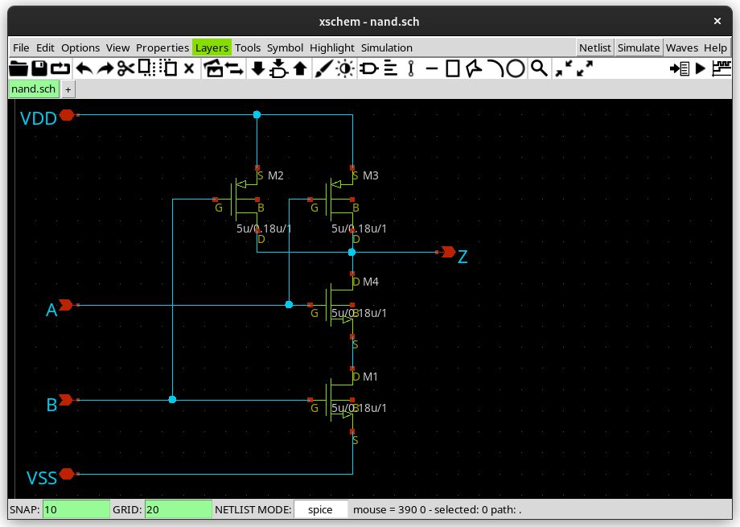
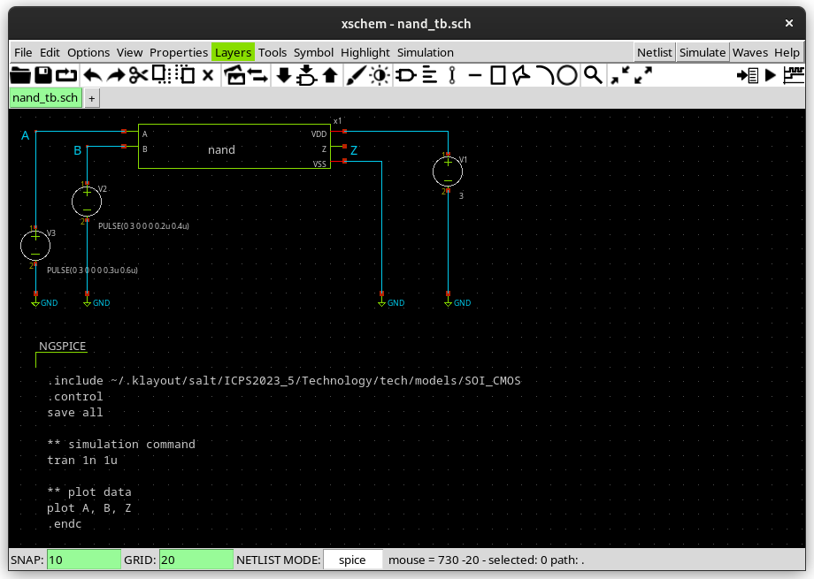
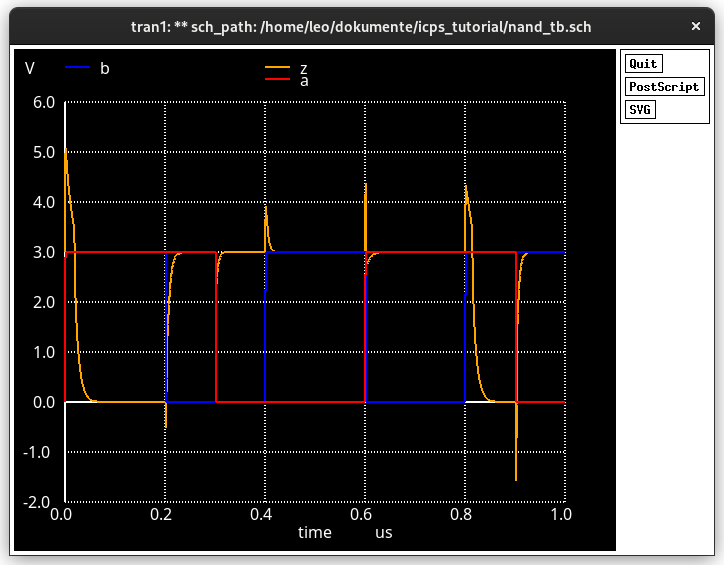
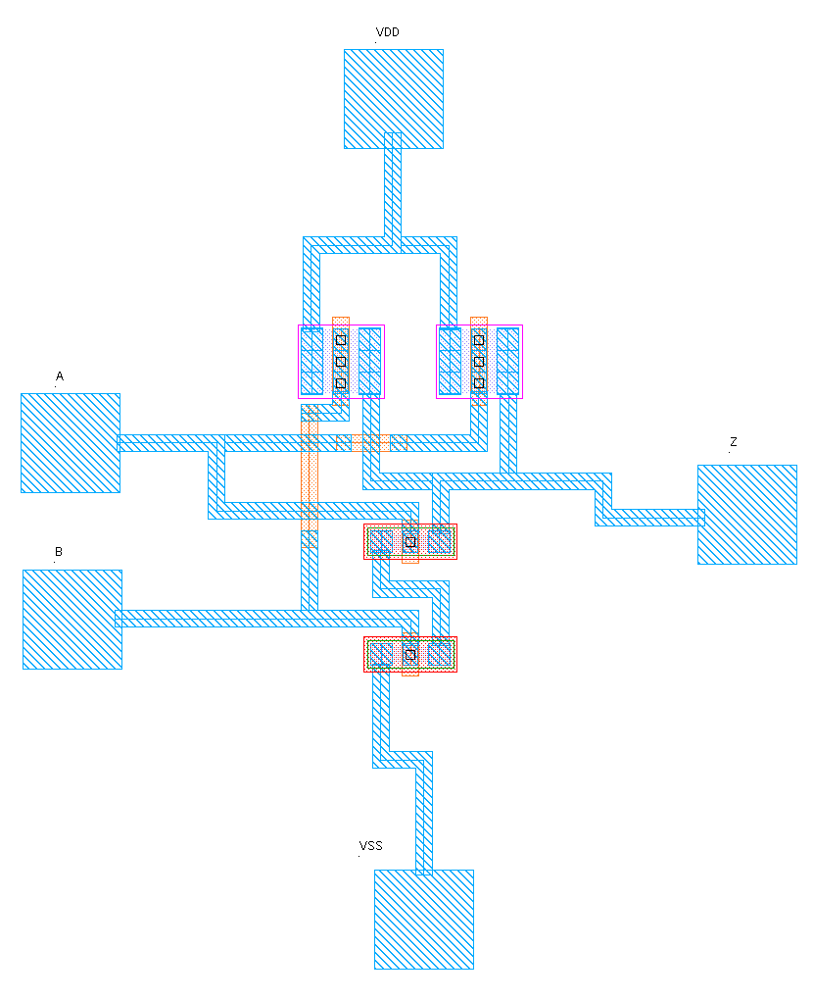

# ICPS Tutorial

This repository contains the data for the tutorial on how to create your own NAND circuit using the [ICPS PDK](https://github.com/mineda-support/ICPS2023_5).

# Schematic

# Simulation

# Layout

# License

Copyright (c) 2023 Leo Moser

This work is licensed under the Apache License, Version 2.0